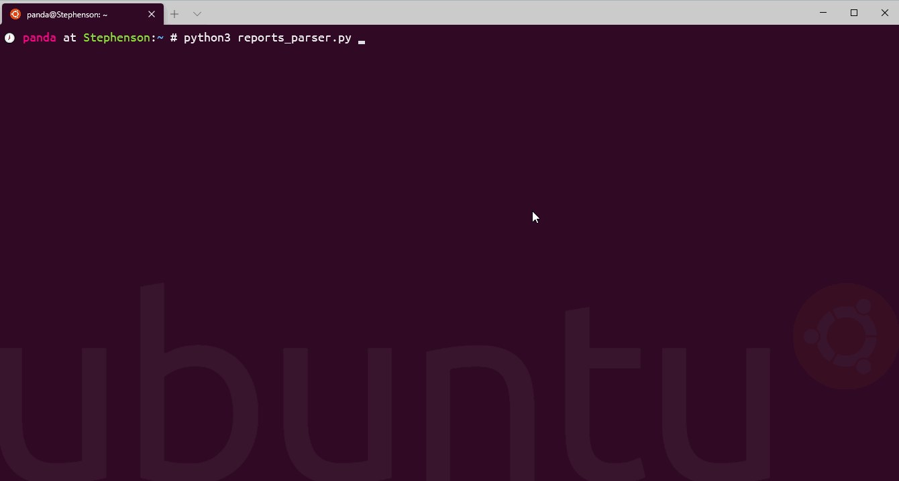

# Демо парсинга отчетов Environmental, Social and Governance

Идеальным вариантом было бы использовать сырые данные от компаний, некоторые компании их предоставляют (https://www.bp.com/content/dam/bp/business-sites/en/global/corporate/xlsx/sustainability/bp-esg-datasheet-2019.xlsx). Однако, так как большинство ограничиваются PDF-отчетами, то вся задача сводится к двум этапам:
1. Извлечение данных
2. Визуализация и аналитика

Извлечение данных проще всего осуществлять на базе заранее определенной схемы данных для отчета. В схеме должны указываться метрики, метод извлечения метрики, а также метод конверсии величины метрики. В качестве метода извлечения проще всего использовать регулярные выражения (с ними знаком каждый разработчик). Тогда описание парсера отчета сводится к подобной структуре (на примере совокупного значения Greenhouse gas emissions):

    {
        'name': 'BP',
        'reports':{
            2019: 'https://www.bp.com/content/dam/bp/business-sites/en/global/corporate/pdfs/sustainability/bp-esg-datasheet-2019.pdf',
        },
        'metrics': {
            'greenhouse gas emissions': {
                'regex': 'Operational control.{1,10}Scope 1 \(direct\) greenhouse gas emissions.*?(\d+\.\d+)\n',
                'unit': 'MteCO2e',
                'convert': as_is
            }
        }
    }
    
Другой пример:

    {
        'name': 'Google',
        'reports':{
            2019: 'https://services.google.com/fh/files/misc/google_2019-environmental-report.pdf',
        },
        'metrics': {
            'greenhouse gas emissions': {
                'regex': 'Greenhouse gas emissions.{1,1000}Total.{1,100}\s([\d\,\.]+)\d{2}\n',
                'unit': 'MteCO2e',
                'convert': tCO2e_to_MteCO2e
            }
        }
    }
    
На этапе демо извлечение выглядит так:

На разработку схемы под один отчет, учитывающую от 10 метрик у middle-разработчика должно уйти не больше 10 часов работы. При этом большее количество метрик не должно влиять на длительность работы. Смысл в подобной работе будет если будущие отчеты будут похожи на предыдущие и в процессе работы получится унифицировать извлечение метрик для отчетов с разной версткой.

Длительность унификации парсинга отчетов оценить не представляется возможным из-за обилия форматов отчетов.

С получеными сырыми данными можно будет удобно работать в фреймворке для анализа данных [pandas](https://pandas.pydata.org/docs/).
